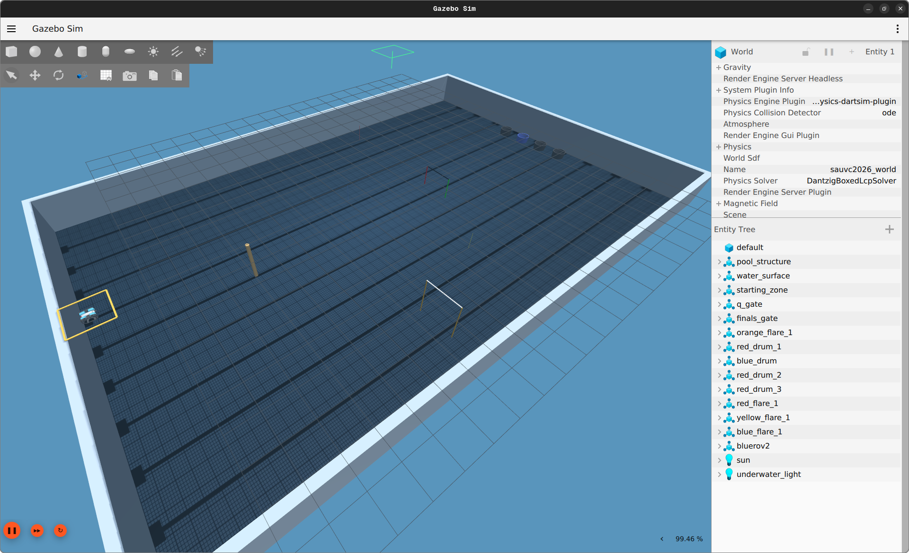

# SAUVC 2026 World Simulation in Gazebo Harmonic

Simulating the Singapore AUV Challenge 2026 competition environment using Gazebo Sim 8 (Harmonic).

Using a model of the [BlueROV2](https://github.com/clydemcqueen/bluerov2_gz), including support for both the base and heavy
configurations. It uses the BuoyancyPlugin,
HydrodynamicsPlugin and ThrusterPlugin.



## Arena Spesfications

- **Pool**: 25m × 16m × 1.6m deep
- **Water simulation**: Buoyancy, underwater fog effects, and lighting
- **World**: Qualification Pool and Final Pool

## Models 

- Starting Zone
- Qualification Gate
- Final Gate
- Drums (red and blue drums)
- Flares (orange, yellow, red, blue)
- BlueROV2
- Golf Ball (still in development)
- Drum Pinger (still in development)

## Requirements

Ensure the requirements below are completed before you install the project:

* [Gazebo Sim 8 (Harmonic)](https://gazebosim.org/docs/latest/getstarted/)
* [ardupilot_gazebo for Harmonic](https://github.com/ArduPilot/ardupilot_gazebo)
* [ArduSub and MAVProxy](https://ardupilot.org/dev/docs/building-setup-linux.html)

## Setup

Install/Clone all these [requirements](#requirements). Ensure ArduSub is already built.

Clone this repository to your colcon workspace.

Add env to .bashrc or .zshrc:
   ```bash
   export GZ_SIM_RESOURCE_PATH=~/<your-colcon-workspace>/src/bluerov2_gz/models:~/ros2_ws/src/bluerov2_gz/worlds
   export GZ_SIM_SYSTEM_PLUGIN_PATH=~/ardupilot_gazebo/build
   ```

(Optional) Build ROS2 in `sauvc26_ros2/`

## Running Gazebo

Gazebo can be run with the commands below:

```bash
gz sim -v 3 -r <gazebo-world-file>
```

where `<gazebo-world-file>` should be replaced with:
* `sauvc_qualification.world` for the qualification arena
* `sauvc_final.world` for the final arena

Now launch ArduSub and ardupilot_gazebo:

```bash
cd ~/ardupilot
Tools/autotest/sim_vehicle.py -L RATBeach -v ArduSub -f vectored --model=JSON --out=udp:0.0.0.0:14550 --console
```

Use MAVProxy to send commands to ArduSub:

```bash
arm throttle
mode alt_hold
rc 5 1550
disarm
```

## MAVROS

Install MAVROS for ROS 2:

```bash
sudo apt install ros-humble-mavros ros-humble-mavros-extras
```
Launch MAVROS with the ArduSub connection:

```bash
ros2 launch mavros apm.launch fcu_url:=udp://:14550@localhost:14555
```

## ROS2 and Colcon

ROS2 users should add `ardupilot_gazebo -b ros2` and `bluerov2_gz` to the colcon workspace and use
colcon to build and manage the environment.

## References

* https://github.com/ardupilot/ardupilot_gazebo/wiki
* https://gazebosim.org/docs/harmonic/install
* https://ardupilot.org/dev/docs/building-setup-linux.html
* https://ardupilot.org/dev/docs/setting-up-sitl-on-linux.html
* https://ardupilot.org/mavproxy/docs/getting_started/download_and_installation.html
* https://www.ardusub.com/developers/rc-input-and-output.html
* https://docs.nvidia.com/datacenter/cloud-native/container-toolkit/install-guide.html
